# Hệ thống quản lý nhà hàng


Đây là đồ án full-stack web app quản lý nhà hàng. Frontend dùng **React + Vite**, backend dùng **NestJS + TypeScript**, database dùng **MySQL**. Hệ thống hỗ trợ khách hàng gọi món/đặt bàn và nhân viên quản trị vận hành nhà hàng.

## Mục lục

- [1. Giới thiệu dự án](#1-giới-thiệu-dự-án)
- [2. Mục tiêu đề tài](#2-mục-tiêu-đề-tài)
- [3. Công nghệ sử dụng](#3-công-nghệ-sử-dụng)
- [4. Chức năng chính](#4-chức-năng-chính)
- [5. Luồng nghiệp vụ chính](#5-luồng-nghiệp-vụ-chính)
- [6. Ảnh giao diện](#6-ảnh-giao-diện)
- [7. Cấu trúc thư mục](#7-cấu-trúc-thư-mục)
- [8. Cài đặt và chạy dự án](#8-cài-đặt-và-chạy-dự-án)
- [9. Cấu hình môi trường](#9-cấu-hình-môi-trường)
- [10. Database](#10-database)
- [11. Tài khoản demo](#11-tài-khoản-demo)
- [12. Lệnh thường dùng](#12-lệnh-thường-dùng)
- [13. Tài liệu liên quan](#13-tài-liệu-liên-quan)

## 1. Giới thiệu dự án

Hệ thống quản lý nhà hàng hỗ trợ tin học hóa các nghiệp vụ vận hành cơ bản: khách hàng xem thực đơn, đặt bàn, gọi món qua QR, thanh toán, xem lịch sử và đánh giá dịch vụ. Nhân viên/quản trị có thể quản lý bàn, đặt bàn, đơn hàng, món ăn, tài khoản nội bộ, khách hàng, đánh giá, mã giảm giá, điểm tích lũy và thống kê doanh thu cơ bản.

Backend chính nằm tại `backend/nest-api/`, frontend chính nằm tại `frontend/`. Frontend gọi backend qua các API có tiền tố `/api`.

## 2. Mục tiêu đề tài

- Tin học hóa quy trình quản lý nhà hàng.
- Giảm thao tác thủ công khi đặt bàn, gọi món và thanh toán.
- Hỗ trợ nhân viên theo dõi trạng thái bàn, đặt bàn và đơn hàng.
- Hỗ trợ quản trị xem thống kê, quản lý dữ liệu vận hành.
- Tạo trải nghiệm thuận tiện cho khách hàng thông qua giao diện web và QR gọi món tại bàn.

## 3. Công nghệ sử dụng

| Thành phần | Công nghệ |
|---|---|
| Frontend | React, Vite, React Router, Ant Design, TanStack Query, Day.js, XLSX |
| Backend | NestJS, TypeScript, JWT, Swagger, class-validator, bcryptjs |
| Database | MySQL |
| Công cụ khác | npm, ESLint, Jest, Prettier |

## 4. Chức năng chính

### Khách hàng

- Xem trang chủ, giới thiệu, thực đơn.
- Đăng ký / đăng nhập.
- Đặt bàn và xem lịch sử đặt bàn.
- Gọi món tại bàn qua QR theo mã bàn.
- Quản lý giỏ hàng.
- Thanh toán đơn gọi món.
- Xem hồ sơ cá nhân.
- Xem lịch sử đơn hàng.
- Xem điểm tích lũy, lịch sử điểm và đổi điểm lấy voucher.
- Đánh giá sau khi sử dụng dịch vụ.

### Nhân viên / Quản trị

- Đăng nhập nội bộ.
- Dashboard vận hành.
- Quản lý bàn và sơ đồ bàn.
- Quản lý đặt bàn.
- Quản lý đơn hàng gọi món tại bàn.
- Quản lý thực đơn / món ăn.
- Quản lý khách hàng.
- Quản lý tài khoản nhân viên / quản trị.
- Quản lý mã giảm giá.
- Quản lý điểm tích lũy thông qua hồ sơ khách hàng và voucher đổi điểm.
- Duyệt / quản lý đánh giá.
- Thống kê doanh thu / hoạt động cơ bản.

## 5. Luồng nghiệp vụ chính

### Luồng khách hàng đặt bàn

1. Khách hàng đăng nhập hoặc nhập thông tin cần thiết.
2. Chọn ngày giờ, số lượng khách và khu vực/bàn nếu có.
3. Hệ thống ghi nhận yêu cầu đặt bàn.
4. Nhân viên xác nhận hoặc xử lý trạng thái đặt bàn.

### Luồng gọi món tại bàn qua QR

1. Khách hàng quét QR tại bàn.
2. Hệ thống mở giao diện thực đơn theo bàn.
3. Khách chọn món và gửi đơn.
4. Nhân viên tiếp nhận, cập nhật trạng thái đơn.
5. Khách thanh toán và có thể đánh giá dịch vụ.

### Luồng quản trị vận hành

1. Nhân viên đăng nhập hệ thống nội bộ.
2. Theo dõi trạng thái bàn, đơn hàng và đặt bàn.
3. Cập nhật món ăn, đơn hàng, khách hàng, mã giảm giá.
4. Quản trị xem thống kê và báo cáo cơ bản.

## 6. Ảnh giao diện

Ảnh minh họa được lưu trong thư mục `screenshots/`.

### Giao diện khách hàng

| Trang chủ | Thực đơn | Đặt bàn |
|---|---|---|
| 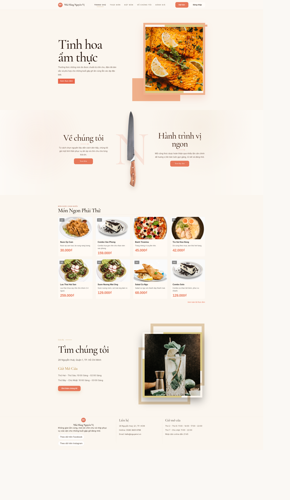 | 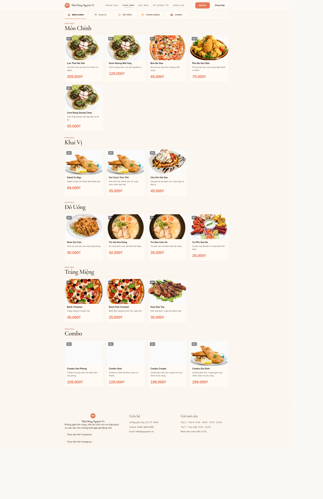 |  |

| Giỏ hàng | Đánh giá | Giới thiệu |
|---|---|---|
| 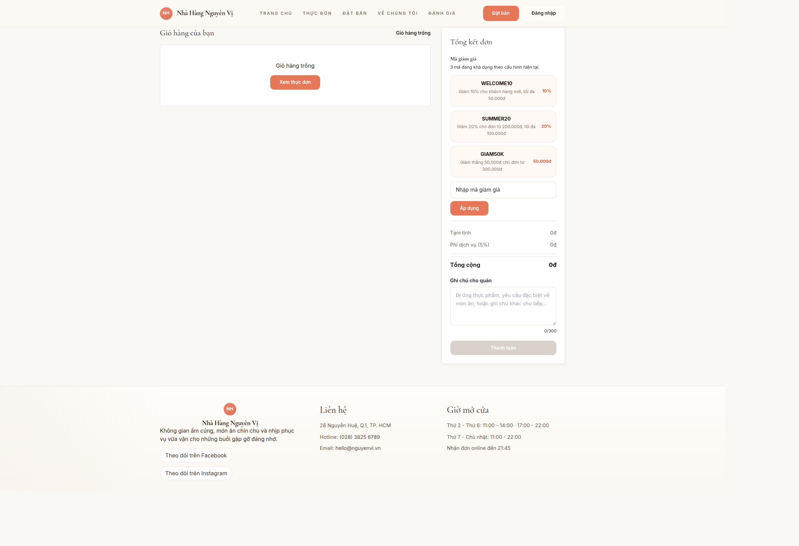 | 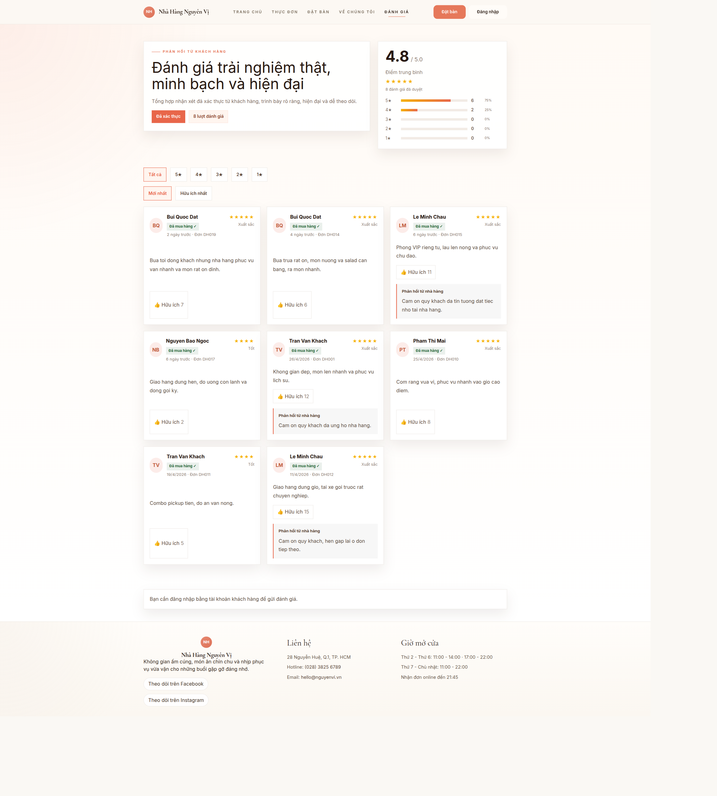 | 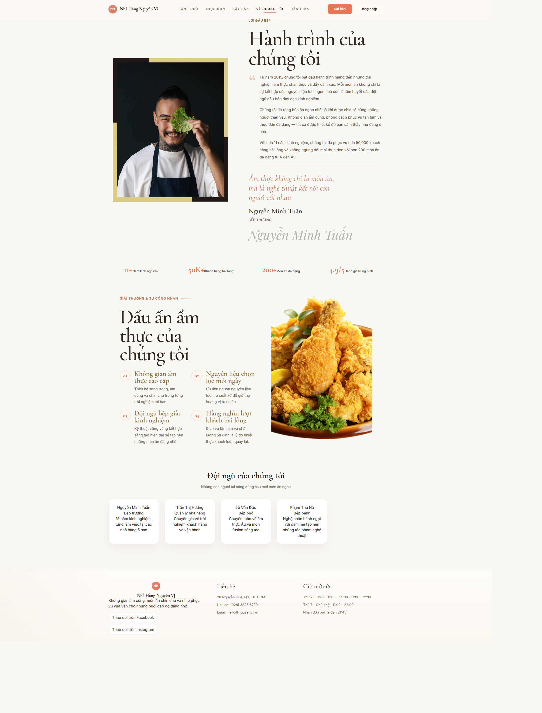 |

| Trang chủ khách hàng | Thanh toán | Hồ sơ |
|---|---|---|
| 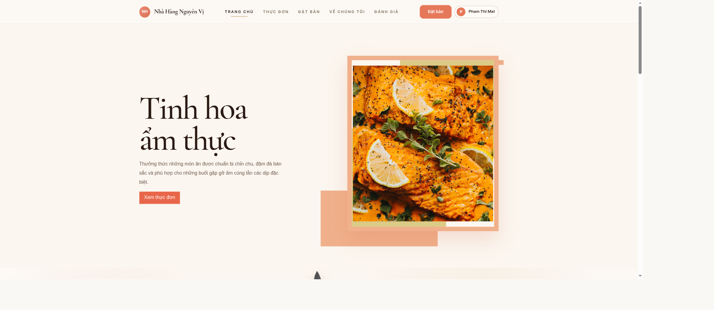 | 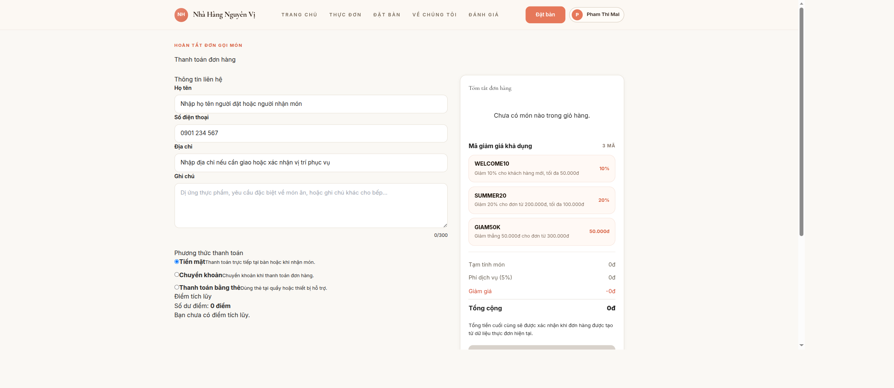 | 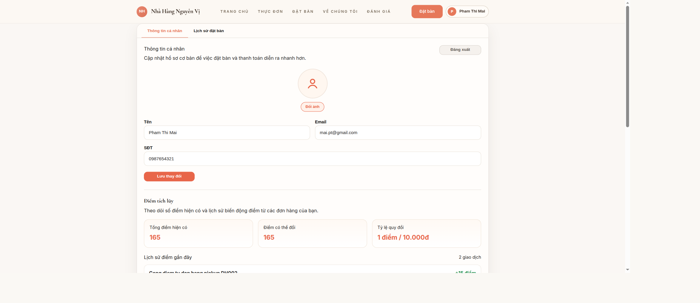 |

### Giao diện quản trị / nội bộ

| Đăng nhập nội bộ | Dashboard | Quản lý thực đơn |
|---|---|---|
| 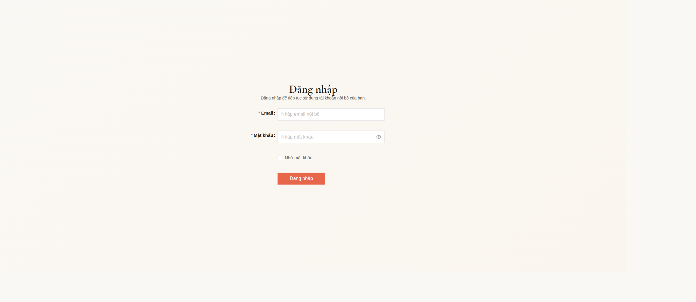 | 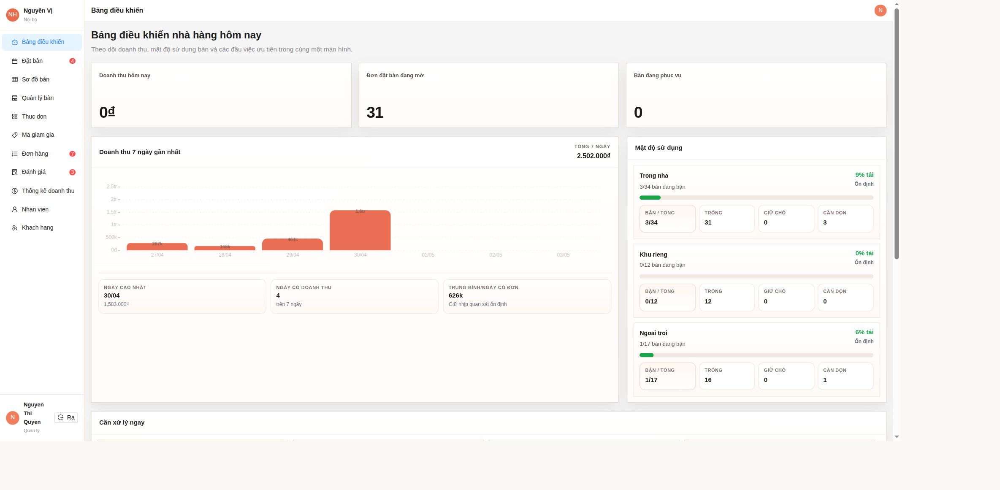 |  |

| Quản lý đặt bàn | Khách hàng | Đơn hàng |
|---|---|---|
|  | 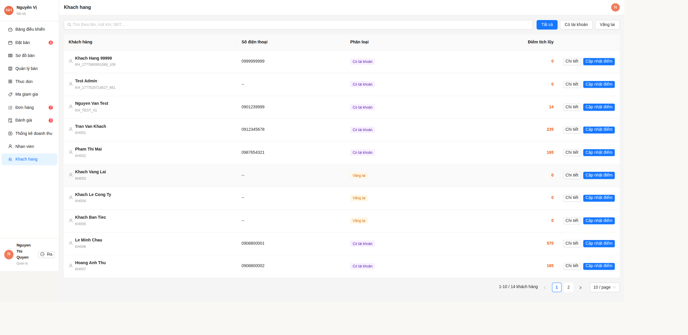 | 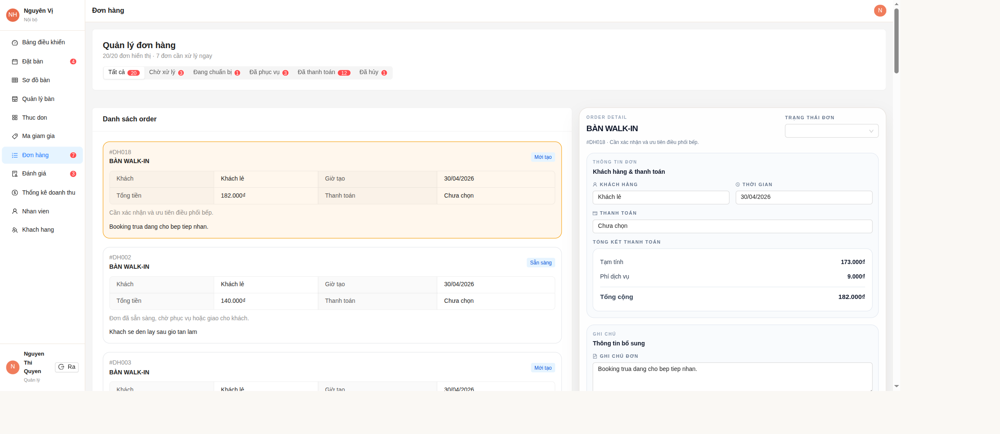 |

| Nhân viên | Thống kê | Đánh giá nội bộ |
|---|---|---|
| 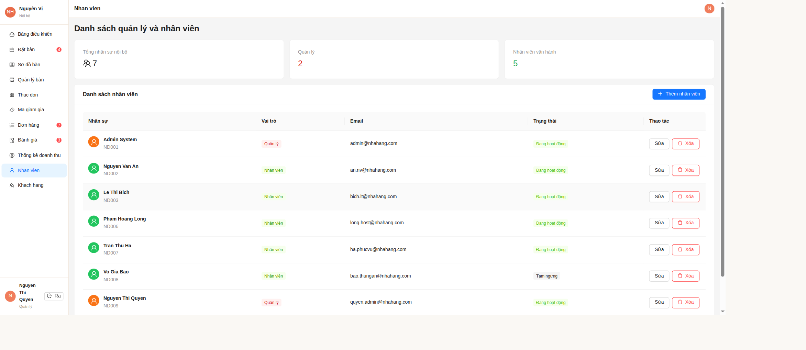 | 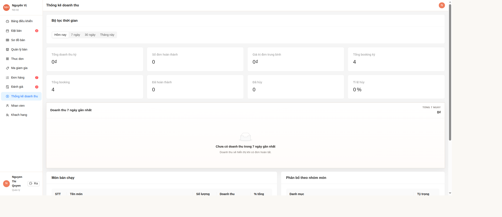 | 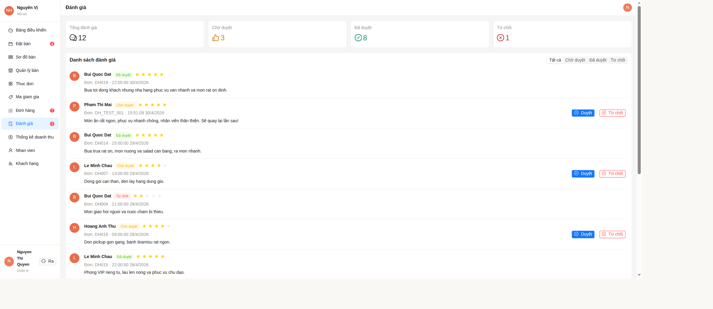 |

## 7. Cấu trúc thư mục

```text
.
├── frontend/              # Ứng dụng React + Vite
├── backend/
│   └── nest-api/          # API NestJS chính
├── database/              # Script khởi tạo schema và dữ liệu mẫu
├── docs/                  # Tài liệu nghiệp vụ / phân quyền / quy tắc frontend
├── screenshots/           # Ảnh giao diện minh họa
├── package.json           # Script điều phối frontend/backend
└── README.md
```

## 8. Cài đặt và chạy dự án

### Yêu cầu môi trường

- Node.js 18+.
- npm.
- MySQL 8.x hoặc phiên bản tương thích.

### Cài đặt dependencies

```bash
npm install
npm --prefix frontend install
npm --prefix backend/nest-api install
```

### Chạy backend

```bash
npm run dev:backend
```

Backend mặc định chạy tại:

- API: `http://localhost:5011/api`
- Swagger: `http://localhost:5011/swagger`

### Chạy frontend

```bash
npm run dev:frontend
```

Hoặc dùng script mặc định ở root:

```bash
npm run dev
```

Frontend mặc định chạy tại `http://localhost:5173`.

## 9. Cấu hình môi trường

### Frontend

Tạo file cấu hình từ mẫu:

```bash
cp frontend/.env.example frontend/.env
```

Giá trị mẫu hiện có:

```env
VITE_PORT=5173
VITE_API_BASE_URL=http://localhost:5011/api
VITE_API_PROXY_TARGET=http://localhost:5011
VITE_USE_BACKEND=true
```

### Backend

Tạo file cấu hình từ mẫu:

```bash
cp backend/nest-api/.env.example backend/nest-api/.env
```

Các biến môi trường theo `backend/nest-api/.env.example`:

```env
NODE_ENV=development
PORT=5011
FRONTEND_ORIGIN=http://localhost:5173
DB_HOST=127.0.0.1
DB_PORT=3306
DB_USERNAME=root
DB_PASSWORD=
DB_DATABASE=QuanNhaHang
DB_AUTO_INIT=false
JWT_SECRET=mot-chuoi-bi-mat-rat-dai-it-nhat-32-ky-tu
JWT_ISSUER=nest-api-quan-ly-nha-hang
JWT_AUDIENCE=quan-ly-nha-hang-frontend
JWT_EXPIRES_IN=12h
JWT_REFRESH_SECRET=mot-chuoi-bi-mat-refresh-rat-dai-it-nhat-32-ky-tu
JWT_REFRESH_EXPIRES_IN=7d
```

> Khi chạy ở máy cá nhân, cập nhật `DB_USERNAME`, `DB_PASSWORD`, `DB_DATABASE` theo MySQL local.

## 10. Database

Thư mục `database/` hiện có:

| File | Mục đích |
|---|---|
| `mysql_init_schema.sql` | Khởi tạo schema MySQL |
| `mysql_seed_dev.sql` | Dữ liệu mẫu phục vụ phát triển/demo |

Import database theo thứ tự:

```bash
mysql -u root -p < database/mysql_init_schema.sql
mysql -u root -p < database/mysql_seed_dev.sql
```

Lưu ý: `DB_AUTO_INIT=true` trong backend hiện chỉ kiểm tra kết nối MySQL, không tự tạo schema.

## 11. Tài khoản demo

Dữ liệu demo được ghi trong `database/mysql_seed_dev.sql`. Không sử dụng các tài khoản này cho môi trường production.

| Vai trò | Email | Mật khẩu |
|---|---|---|
| Admin | `admin@nhahang.com` | `Admin@123` |
| Nhân viên | `an.nv@nhahang.com` | `Staff@123` |
| Nhân viên | `bich.lt@nhahang.com` | `Staff@123` |
| Khách hàng | `khach1@gmail.com` | `Khach@123` |
| Khách hàng | `mai.pt@gmail.com` | `Khách@123` |

Một số tài khoản seed khác có thể tồn tại để kiểm thử dữ liệu mở rộng. Cập nhật theo dữ liệu seed của dự án khi thay đổi file seed.

## 12. Lệnh thường dùng

Các lệnh dưới đây khớp với `package.json` ở root:

| Lệnh | Ý nghĩa |
|---|---|
| `npm run dev` | Chạy frontend Vite |
| `npm run dev:frontend` | Chạy frontend Vite |
| `npm run dev:backend` | Chạy backend NestJS ở chế độ development |
| `npm run build` | Build frontend và backend |
| `npm run build:frontend` | Build frontend |
| `npm run build:backend` | Build backend |
| `npm run lint` | Chạy lint frontend và backend |
| `npm run test` | Chạy test frontend và backend |
| `npm run preview` | Preview bản build frontend |
| `npm run smoke:api` | Chạy smoke test API theo script hiện có |

Một số lệnh riêng:

```bash
npm --prefix frontend run build
npm --prefix frontend run lint
npm --prefix backend/nest-api run build
npm --prefix backend/nest-api run test
```

## 13. Tài liệu liên quan

| Tài liệu | Nội dung |
|---|---|
| `docs/MO_TA_NGHIEP_VU.md` | Mô tả nghiệp vụ và hiện trạng triển khai |
| `docs/ma-tran-phan-quyen-api.md` | Ma trận phân quyền API |
| `docs/quytacfe.md` | Quy tắc frontend |
| `backend/README.md` | Ghi chú backend cấp thư mục |
| `backend/nest-api/README.md` | Ghi chú backend NestJS |

## Ghi chú

Đây là đồ án phục vụ học tập. Các chức năng như thống kê nâng cao, BI, quản lý kho/nguyên liệu hoặc vận hành đa chi nhánh không được mô tả là hoàn thiện vì chưa phải trọng tâm triển khai hiện tại của repo.
