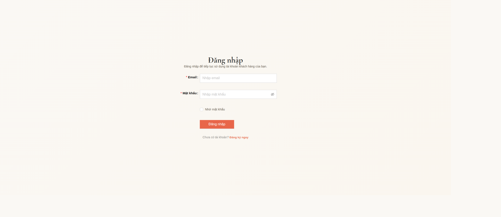

# Hệ thống quản lý nhà hàng

> Đồ án full-stack web app cho bài toán quản lý nhà hàng, gồm frontend React + Vite, backend NestJS + TypeScript và MySQL.

## Tổng quan

Hệ thống hỗ trợ 2 nhóm người dùng chính:

- **Khách hàng**: xem thực đơn, đặt bàn, gọi món tại bàn qua QR, thanh toán, theo dõi lịch sử đơn hàng.
- **Nội bộ**: đăng nhập quản trị, quản lý bàn, đặt bàn, đơn hàng, món ăn, tài khoản, đánh giá và thống kê cơ bản.

## Công nghệ sử dụng

| Thành phần | Công nghệ |
|---|---|
| Frontend | React, Vite, React Router, Ant Design, TanStack Query |
| Backend | NestJS, TypeScript, JWT, Swagger |
| Database | MySQL |

## Cấu trúc dự án

```text
frontend/        # Ứng dụng React + Vite
backend/nest-api/ # API NestJS chính
 database/       # Script khởi tạo schema / dữ liệu
screenshots/     # Ảnh giao diện minh họa
```

## Chức năng chính

### Khách hàng

- Trang chủ, giới thiệu, thực đơn
- Đăng ký / đăng nhập
- Đặt bàn
- Giỏ hàng và thanh toán
- Hồ sơ cá nhân, lịch sử đơn hàng, lịch sử đặt bàn
- Đánh giá sau đơn hàng
- Gọi món tại bàn qua QR
- Đơn mang về

### Nội bộ

- Đăng nhập nội bộ
- Dashboard vận hành
- Quản lý bàn và sơ đồ bàn
- Quản lý đặt bàn
- Quản lý đơn hàng tại chỗ và mang về
- Quản lý món ăn
- Quản lý tài khoản nhân viên / quản trị
- Duyệt đánh giá
- Thống kê doanh thu cơ bản

## Ảnh giao diện

> Ảnh được lưu trong thư mục `screenshots/`.

| Trang chủ | Thực đơn | Đặt bàn |
|---|---|---|
|  |  |  |

| Giỏ hàng | Đánh giá | Đăng nhập |
|---|---|---|
|  |  |  |

| Admin login | Dashboard | Quản lý thực đơn |
|---|---|---|
|  |  |  |

## Yêu cầu môi trường

- Node.js 18+
- npm
- MySQL 8.x hoặc tương thích

## Cài đặt nhanh

```bash
npm install
npm --prefix frontend install
npm --prefix backend/nest-api install
```

## Chạy dự án

### Frontend

```bash
npm run dev
```

### Backend

```bash
npm run dev:backend
```

## Cấu hình môi trường

### Frontend `frontend/.env`

```env
VITE_USE_BACKEND=true
VITE_API_BASE_URL=http://localhost:5011/api
```

### Backend `backend/nest-api/.env`

Tạo từ mẫu:

```bash
cp backend/nest-api/.env.example backend/nest-api/.env
```

Biến quan trọng:

```env
PORT=5011
FRONTEND_ORIGIN=http://localhost:5173
DB_HOST=127.0.0.1
DB_PORT=3306
DB_USER=root
DB_PASSWORD=your_mysql_password
DB_NAME=QuanNhaHang
DB_AUTO_INIT=false
JWT_SECRET=mot-chuoi-bi-mat-rat-dai-it-nhat-32-ky-tu
JWT_ISSUER=nest-api-quan-ly-nha-hang
JWT_AUDIENCE=quan-ly-nha-hang-frontend
JWT_EXPIRES_IN=12h
```

## Khởi tạo database

Import file:

- `database/mysql_init_schema.sql`

## Lệnh thường dùng

```bash
npm run build
npm run build:frontend
npm run build:backend
npm run lint
npm run lint:backend
npm run test
npm run test:backend
npm run smoke:api
```

## API chính

- `/api/auth`
- `/api/nguoi-dung`
- `/api/thuc-don`
- `/api/ban`
- `/api/dat-ban`
- `/api/don-hang`
- `/api/ma-giam-gia/validate`
- `/api/danh-gia`
- `/api/mang-ve`
- `/api/diem-tich-luy`
- `/api/thong-ke`

Swagger:

- `http://localhost:5011/swagger`

## Tài liệu liên quan

- `docs/MO_TA_NGHIEP_VU.md`
- `docs/ma-tran-phan-quyen-api.md`
- `backend/README.md`
- `backend/nest-api/README.md`
